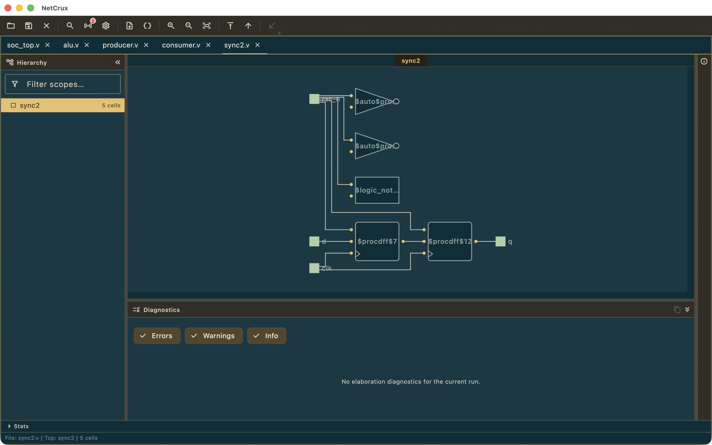

# netcrux

[](LICENSE)

NetCrux is an interactive RTL schematic browser and signal tracer: it elaborates your
Verilog/SystemVerilog/VHDL through Yosys, lays the result out as a navigable schematic,
and lets you walk the hierarchy and trace drivers and loads. Open core, part of Ferrite
Engineering's EDACrux suite.



<sub>NetCrux showing a small SoC elaborated through Yosys — hierarchy on the left, schematic on the right.</sub>

## Status

Public beta. Implemented in this repository today:

- Yosys-backed elaboration of Verilog / SystemVerilog / VHDL, with an elaboration cache,
  a bounded and killable subprocess, and structured error reporting.
- ELK-based schematic layout with a tabbed, split-pane workspace, hierarchy tree,
  inspector, breadcrumb scope navigation, and zoom/pan.
- One-step fanin/fanout tracing with a dimming overlay.
- Substring / glob / regex design search across instances, cells and nets.
- PNG, SVG and JSON export; `.netcrux` sessions, `.netcrux-project` projects,
  `.netcrux-workspace` workspaces, and Vivado-style `.f` filelist import.
- A CXP cross-probe server for the rest of the EDACrux suite.
- Update checks, the beta issue reporter, themes, rebindable shortcuts, and
  en/zh_CN/zh/ja/ko localization.

## Try it

[`examples/`](examples/README.md) holds ready-to-open projects. Launch NetCrux, then
**File → Open Project…** (`Cmd/Ctrl+O`) and pick one:

- [`examples/adder4/`](examples/adder4/adder4.netcrux-project) — the smallest thing
  NetCrux draws: five ports and two `$add` cells. The fastest way to confirm your
  Yosys install works.
- [`examples/cdc-capture/`](examples/cdc-capture/cdc-capture.netcrux-project) — the
  suite's shared two-clock-domain demo design: 18 cells and 7 flops, enough to
  exercise the hierarchy tree, design search, the inspector, and fanin/fanout
  tracing.

**Both need `yosys` on your `PATH`** — see [Prerequisites](#prerequisites). Unlike
its sibling tools, NetCrux has no toolchain-free entry point: a schematic is a view
of an elaborated netlist, and on desktop only a live Yosys run produces one. Without
Yosys the examples open a tab and say so on the canvas rather than failing silently.

## Pattern reference

`netcrux` follows the same open-core + Pro/Enterprise overlay pattern as WaveCrux:

- This repository is the open-core viewer/tool.
- The closed-source Pro/Enterprise overlay consumes this repo as a Git submodule and depends on it through a pubspec `path: ./netcrux` entry, layering its features via a `proOverrides` list spread into the open-core `ProviderScope`.

When in doubt about a convention, file layout, naming choice, or architectural seam, consult the WaveCrux reference implementation. Match its pattern unless this project has a documented reason to diverge.

## Prerequisites

NetCrux does **not** ship Yosys. Install it and put it on your `PATH` — NetCrux looks for
`yosys` (`yosys.exe` on Windows). Without it, elaboration fails with "Yosys could not be
found or run"; you can also point `Settings → Engines` at a custom Yosys path, or pass
`--yosys-path`.

VHDL additionally needs `ghdl` on your `PATH`. NetCrux lowers VHDL to Verilog with a
standalone `ghdl --synth --out=verilog` invocation before Yosys runs, so a plain GHDL
build is enough — no `ghdl-yosys-plugin` and no plugin-capable Yosys build.

## Build & run

```bash
git submodule update --init --recursive   # crux-shared
flutter pub get
flutter run -d macos      # or -d linux, -d windows
flutter analyze
flutter test
```

The `Bundled` binary-source mode in `Settings → Engines` is a forward-looking seam: no
Yosys binary ships inside the release distribution today, so it resolves only when the
`NETCRUX_BUNDLED_BIN_DIR` environment variable points at a binary directory and otherwise
falls back to the `PATH` lookup. See [`NOTICES`](NOTICES) §1.

## Platform support

| Platform | State | Notes |
|---|---|---|
| Linux | Supported | Primary target. |
| macOS | Supported | macOS 12.0 or later. |
| Windows | Supported | |
| Web | Supported | Read-only schematic viewer — no Yosys runs in a browser, so it renders netlists elaborated elsewhere. |

No mobile build: a schematic browser is a pointer-and-keyboard tool, and the
elaboration step needs a local toolchain.

## Contributing

Read [`CONTRIBUTING.md`](CONTRIBUTING.md) first — contributions require a signed
Contributor License Agreement ([`CLA.md`](CLA.md)).
[`docs/ARCHITECTURE.md`](docs/ARCHITECTURE.md) is the engineering reference: tech
stack, architectural rules, and the extension-point seams the Pro overlay plugs
into. User documentation lives at [docs.netcrux.app](https://docs.netcrux.app), and
its source is in [`docs-site/docs/`](docs-site/docs/).

The quality gates, all of which must pass:

```bash
flutter analyze --fatal-infos --fatal-warnings   # zero-warning policy
flutter test
```

## License

NetCrux open core is licensed under the Apache License 2.0. See
[`LICENSE`](LICENSE) for the full text and [`NOTICES`](NOTICES) for
third-party attributions. Contributions require a signed
Contributor License Agreement — see
[`CONTRIBUTING.md`](CONTRIBUTING.md).

Apache-2.0 §6 grants no trademark rights, so the name and logo are
covered separately — see [`TRADEMARK.md`](TRADEMARK.md). Forks are
welcome; they just need a different name.
